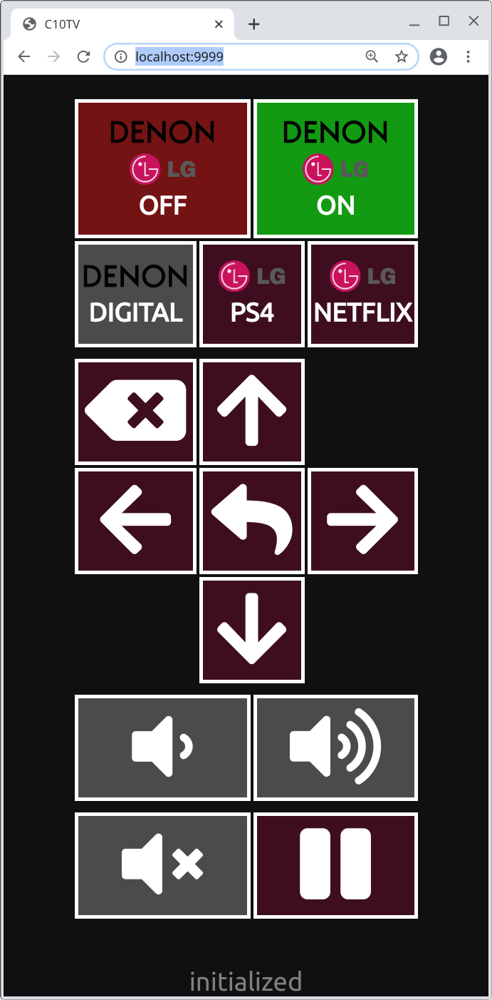

# c10tv

WebUI to control LG TV (webOS) and DENON Amplituner combo from smartphone.



## setup

```
pip3 install -r requirements.txt
```

### example systemd service file
```
[Unit]
Description=C10TV
After=syslog.target
After=network.target

[Service]
RestartSec=5s
Type=simple
User=www
WorkingDirectory=/opt/c10tv/
ExecStart=/usr/bin/python3 /opt/c10tv/c10tv.py
Restart=always
 
[Install]
WantedBy=multi-user.target
```

### `.pylgtv`

pylgtv library requests permission from TV user to be paired - it only needs to be done once, but some secrets are saved in current workign directory of app as `.pylgtv` so make sure it's writable by user running python.
